# System Architecture: GraphRAG-Edu-Suite

This project is an advanced **Dual-Model Graph-based Retrieval-Augmented Generation (GraphRAG)** learning system, specifically optimized for hardware with limited VRAM (4GB).

## 💡 The Core Vision
The suite transforms study materials into a **Living Knowledge Base**. By combining a high-reasoning "Thinking" model with a fast "Logic" model, it builds a precise Knowledge Graph used to generate Bloom-aligned educational content.

```mermaid
flowchart LR
    subgraph INPUT ["📂 1. INPUT"]
        direction TB
        A1["Digital PDF"]
    end

    subgraph BRAIN ["🧠 2. DUAL-AI ENGINE"]
        direction TB
        B1["DeepSeek-R1 (Extraction)"]
        B2["Dynamic VRAM Swapping"]
        B3["Llama 3.2 (Generator)"]
    end

    subgraph KNOWLEDGE ["🕸️ 3. THE GRAPH (Neo4j)"]
        direction TB
        C1["Deterministic Python Cypher"]
        C2["Nodes: Concepts & Facts"]
        C3["Edges: Standardized Schema"]
    end

    subgraph OUTPUT ["🎓 4. LEARNING"]
        direction TB
        D1["Bloom-Level Quizzes"]
        D2["Generator-Critic Loop"]
    end

    INPUT --> BRAIN
    BRAIN --> KNOWLEDGE
    KNOWLEDGE --> OUTPUT
    
    style INPUT fill:#f5f5f5,stroke:#333
    style BRAIN fill:#e1f5fe,stroke:#01579b
    style KNOWLEDGE fill:#fff3e0,stroke:#e65100
    style OUTPUT fill:#e8f5e9,stroke:#1b5e20
```

---

## 🏗️ Technology Stack

| Component | Responsibility |
| :--- | :--- |
| **Streamlit** | Frontend UI and Session Persistence. |
| **LangChain** | LLM Orchestration and Context Management. |
| **Ollama** | Local inference (DeepSeek-R1 for facts, Llama 3.2 for logic). |
| **Neo4j** | Graph Database for relational knowledge storage. |
| **Python** | Deterministic Cypher generation and VRAM controller. |

## 🔄 Lifecycle Diagram

## 🛠️ Key Architectural Decisions

### 1. Dynamic VRAM Swapping
Hardware with **4GB VRAM** cannot run DeepSeek-R1 (8B) and Llama 3.2 (3B) simultaneously.
- **The Solution**: Before any model-intensive task, the system calls `ollama stop` on the idle model.
- **The Result**: 100% stability on limited hardware without compromising model intelligence.

### 2. Deterministic Cypher Generation
Relying on LLMs to write raw Cypher code is fragile (syntax errors, hallucinated labels).
- **The Solution**: DeepSeek extracts raw JSON data; a **Python module** builds the Cypher statements using standardized templates.
- **The Result**: 0% database insertion failures.

### 3. Generator-Critic Loop
To ensure quiz quality and factual grounding:
- **Llama 3.2 (Generator)**: Creates initial questions based on retrieved nodes.
- **Llama 3.2 (Critic)**: Re-evaluates the quiz against the context to fix logic or grounding errors.
- **Outcome**: Questions are strictly aligned with **Bloom's Taxonomy**.

## 🧠 Model Roles
- **DeepSeek-R1 (8B)**: The "Extractor". Used for its superior reasoning to identify complex entity relationships.
- **Llama 3.2 (3B)**: The "Orchestrator". Used for fast JSON formatting, quiz generation, and acting as the grading critic.
