# System Architecture: GraphRAG-Edu-Suite

This project is an advanced **Graph-based Retrieval-Augmented Generation (GraphRAG)** learning system. It transforms static documents into a dynamic knowledge graph to generate high-quality educational content.

## 💡 The Full Idea: Vision to Intelligence

The core concept is to take **any** study material (even handwritten or scanned notes) and turn it into a **Living Knowledge Base** that can test you, grade you, and help you master a subject.

```mermaid
flowchart LR
    subgraph INPUT ["📂 STEP 1: INPUT"]
        direction TB
        A1["Digital PDF"]
        A2["Scanned Notes/Images"]
    end

    subgraph BRAIN ["🧠 STEP 2: LOCAL AI (Ollama)"]
        direction TB
        B1["LLaVA 'Sees' the text"]
        B2["Llama 3 'Understands' concepts"]
        B3["Graph Transformer maps links"]
    end

    subgraph KNOWLEDGE ["🕸️ STEP 3: THE GRAPH (Neo4j)"]
        direction TB
        C1["Nodes: Facts & Definitions"]
        C2["Edges: Logical Relationships"]
    end

    subgraph OUTPUT ["🎓 STEP 4: LEARNING"]
        direction TB
        D1["Custom MCQ Quizzes"]
        D2["Deep Essay Prompts"]
        D3["AI Grading & Feedback"]
    end

    INPUT --> BRAIN
    BRAIN --> KNOWLEDGE
    KNOWLEDGE --> OUTPUT
    
    %% Styling
    style INPUT fill:#f5f5f5,stroke:#333
    style BRAIN fill:#e1f5fe,stroke:#01579b
    style KNOWLEDGE fill:#fff3e0,stroke:#e65100
    style OUTPUT fill:#e8f5e9,stroke:#1b5e20
```

---

## 🏗️ Technology Stack

| Component | Responsibility |
| :--- | :--- |
| **Streamlit** | Frontend UI and Session Management. |
| **LangChain** | Orchestration framework for LLM chains and Graph transformers. |
| **Ollama** | Local inference engine for Llama 3 (Text) and LLaVA (Vision). |
| **Neo4j (Aura)** | Graph Database for storing entities and relationships. |
| **PyMuPDF / VLM** | Text extraction from digital and scanned PDFs. |

## 🔄 End-to-End System Diagram

This diagram illustrates the full lifecycle of a document in the GraphRAG-Edu-Suite, from the initial upload to the final AI-powered evaluation.

## ⏳ The RAG Workflow (Sequence)

This sequence diagram shows exactly what happens, step-by-step, when you click **"Generate Quiz"**.

### 1. The Knowledge Extraction Phase
- **Chunking**: Documents are split into overlapping chunks (1000-2000 chars) so the LLM doesn't lose context.
- **Entity Extraction**: `LLMGraphTransformer` uses Llama 3 to identify "Concepts", "Processes", and "Relationships".
- **Graph Ingestion**: These entities are stored in Neo4j, creating a web of connected knowledge rather than just a flat list of text.

### 2. The Retrieval Phase (GraphRAG)
Unlike standard RAG (which just finds similar text chunks), **GraphRAG** traverses relationships. 
- When generating a quiz, the system queries Neo4j for specific facts and their logical links (e.g., `Concept A --[IMPLEMENTS]--> Process B`).
- This prevents hallucinations by forcing the LLM to use only established graph paths.

### 3. The Generation Phase
- **MCQ Quiz**: The LLM creates questions with 1 correct answer and 3 distractors based solely on graph facts.
- **Essay Lab**: The system challenges students to connect disparate nodes in the graph (e.g., "Explain how Process B affects Concept C").
- **Self-Audit**: A two-step "Critic" loop verifies the generated JSON before showing it to the user.

## 🧠 Model Roles
- **Llama 3 (8B)**: The "Brain". Handles logic, JSON formatting, and complex relationship extraction.
- **LLaVA**: The "Eyes". Specifically used when a PDF is detected as an image to "read" the text visually.
