# 🧠 GraphRAG-Edu-Suite

**Transforming Study Materials into a Living Knowledge Base.**

GraphRAG-Edu-Suite is an advanced **Dual-Model Graph-based Retrieval-Augmented Generation (GraphRAG)** learning system. It is specifically engineered to run high-quality AI models on hardware with limited resources (e.g., 4GB VRAM), providing students with a powerful, deterministic, and interactive learning environment.

---

## 💡 The Core Vision
Standard RAG systems often suffer from "context blindness." GraphRAG-Edu-Suite solves this by converting static PDF documents into a **structured Neo4j Knowledge Graph**. By combining a "Thinking" model (DeepSeek-R1) for extraction with a "Reasoning" model (Llama 3.2), it generates Bloom-aligned quizzes and provides real-time performance analytics.

## 🚀 Key Features

### 1. Dynamic VRAM Swapping (4GB Optimization)
Hardware with limited VRAM cannot run 8B and 3B models simultaneously. Our system implements a **VRAM Controller** that dynamically stops and starts models via Ollama to ensure 100% stability without compromising intelligence.

### 2. Deterministic Cypher Generation
Unlike fragile systems that rely on LLMs to write raw database queries, we use a **Python-based Cypher Builder**. DeepSeek extracts clean JSON, and our logic builds the graph statements, resulting in **0% insertion failures**.

### 3. Generator-Critic Quiz Loop
To ensure academic rigor, all generated content passes through a **Generator-Critic loop**. Llama 3.2 creates the questions, and DeepSeek-R1 audits them for factual accuracy and logic before they reach the student.

### 4. Bloom-Aligned Analytics
Track mastery across cognitive dimensions (Remembering, Understanding, Applying, etc.). The system provides radar profiles and actionable learning recommendations based on quiz performance.

---

## 🏗️ Technology Stack

| Component | Responsibility |
| :--- | :--- |
| **Streamlit** | Frontend UI & Interactive Dashboard |
| **LangChain** | LLM Orchestration & RAG Pipeline |
| **Ollama** | Local Inference (DeepSeek-R1 & Llama 3.2) |
| **Neo4j** | Graph Database (Relational Memory) |
| **Plotly** | Performance Analytics & Visualization |

---

## 🔄 System Architecture

### 1. High-Level Flow

```mermaid
flowchart LR
    subgraph INPUT ["📂 1. INPUT"]
        direction TB
        A1["Digital PDF"]
    end

    subgraph BRAIN ["🧠 2. DUAL-AI ENGINE"]
        direction TB
        B1["DeepSeek-R1 (Extraction)"]
        B2["Dynamic VRAM Swapping"]
        B3["Llama 3.2 (Generator)"]
    end

    subgraph KNOWLEDGE ["🕸️ 3. THE GRAPH (Neo4j)"]
        direction TB
        C1["Deterministic Python Cypher"]
        C2["Nodes: Concepts & Facts"]
        C3["Edges: Standardized Schema"]
    end

    subgraph OUTPUT ["🎓 4. LEARNING"]
        direction TB
        D1["Bloom-Level Quizzes"]
        D2["Generator-Critic Loop"]
    end

    INPUT --> BRAIN
    BRAIN --> KNOWLEDGE
    KNOWLEDGE --> OUTPUT
    
    style INPUT fill:#f5f5f5,stroke:#333
    style BRAIN fill:#e1f5fe,stroke:#01579b
    style KNOWLEDGE fill:#fff3e0,stroke:#e65100
    style OUTPUT fill:#e8f5e9,stroke:#1b5e20
```


### 2. Implementation Lifecycle


---

## 🛠️ Setup & Installation

### Prerequisites
-   **Python 3.10+**
-   **Ollama** installed and running.
-   **Neo4j** (Aura Cloud or Local Desktop).

### 1. Clone & Install Dependencies
```bash
git clone <repository-url>
cd GraphRAG-Edu-Suite
pip install -r requirements.txt
```

### 2. Pull Required Models
```bash
ollama pull deepseek-r1:8b
ollama pull llama3.2:latest
```

### 3. Environment Configuration
Create a `.env` file in the root directory:
```env
NEO4J_URI=neo4j+s://your-instance.databases.neo4j.io
NEO4J_USERNAME=neo4j
NEO4J_PASSWORD=your-password
```

### 4. Run the Application
```bash
streamlit run main.py
```

---

## ✍️ Usage Guide
1.  **Ingestion**: Upload your PDF study materials via the sidebar.
2.  **Build Graph**: Click "Build Knowledge Graph" (DeepSeek will extract nodes/edges).
3.  **Quiz Lab**: Choose a lesson and generate Bloom-aligned MCQs.
4.  **Essay Lab**: Practice long-form answers graded by AI.
5.  **Analytics**: Review your mastery profile and focus on weak areas.
